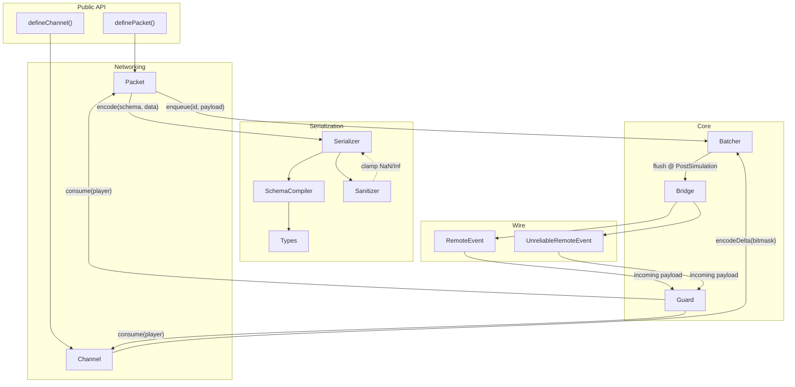

<div align="center">

# Sat·Set


</div>

**sat·set** /sat-sèt/ *adjective (slang)* — Indonesian colloquialism for being rapid, efficient, and quick to act.

> *"Sat set, sampai."* — Indonesian for "Swiftly done."

Satset is a high-performance networking library for [Roblox](https://roblox.com). It handles the heavy lifting of buffer serialization and state synchronization. It connects low-level data packing with high-level state sync, offering a unified API for both stateless events (Packets) and delta-compressed channels.

The library is built on the principle that code on the hot path should not allocate. By using native Luau `buffer` operations and focusing on O(1) operations, Satset maintains performance even when syncing hundreds of entities per frame.

# Performance Benchmarks

Satset is designed for high-throughput scenarios. We maintain a [benchmark suite](benchmark/Benchmarks.md) that measures Satset against native RemoteEvents and other established libraries:

- **[ByteNet](https://github.com/ffrostfall/ByteNet)**: A buffer-based serialization library.
- **[BridgeNet2](https://github.com/ffrostfall/BridgeNet2)**: A high-level batching library.
- **[Warp](https://github.com/imezx/Warp)**: A rapidly-fast networking library.
- **[Packet](https://devforum.roblox.com/t/packet-networking-library/3573907/414)**: A binary-heavy packet library with built-in rate limiting.

Detailed methodology and raw data can be found in the [Benchmarks Report](benchmark/Benchmarks.md).

# Documentation

Comprehensive technical documentation is available in the `docs/` directory:

- **[Architecture & Getting Started](docs/guide/getting-started.md)**: High-level overview and initialization.
- **[API Reference](docs/api/satset.md)**: Detailed breakdown of the `Satset` namespace.
- **[Security & Guard](docs/guide/security.md)**: Documentation on the token bucket rate limiting implementation.
- **[Serialization Types](docs/api/types.md)**: Available data types for buffer-backed schemas.

# Features

### Hybrid Networking Engine

Satset provides two distinct communication modes:

- **Packets (Stateless)**: For one-off events like character actions or effects. These are batched automatically every frame to minimize RemoteEvent overhead.
- **Channels (Stateful)**: The core state synchronization engine. It tracks changes to a defined schema and transmits only the dirty fields (deltas) using bitmask-based compression.

### Implementation Details

- **Zero-GC Pipeline**: All serialization occurs in pre-allocated buffers. No temporary tables are generated during encoding or decoding, minimizing garbage collector pressure.
- **Hardened Sanitization**: All floating-point types (`f32`, `f64`, `Vector3`, etc.) are sanitized against `NaN` and `±Infinity` to prevent server-side state corruption.
- **FASTCALL Optimization**: The implementation utilizes Luau VM [fastcalls](https://luau.org/performance) for buffer and math built-ins to ensure near-native execution speed.
- **Per-frame Batching**: Remote calls are deferred until `PostSimulation`, ensuring exactly one remote invocation per player per frame.
- **Reliability Layers**: Native support for [UnreliableRemoteEvent](https://create.roblox.com/docs/reference/engine/classes/UnreliableRemoteEvent) with sequence numbers and stale packet checks.
- **MTU Management**: Automatic fragmentation for batches exceeding the MTU limit.
- **Guard**: Built-in server-side rate limiting using a token bucket algorithm to prevent network-based exploits.

# Architecture

The following diagram shows how data flows through Satset's internal modules, from the public API down to the wire.



For a detailed step-by-step walkthrough of a packet's lifecycle, see the [Architecture Guide](docs/guide/architecture.md).

# Usage

### Installation

Add Satset to your `wally.toml`:

```toml
Satset = "bookek/satset@0.1.2"
```

Then run `wally install`.

### Initialization

Initialization is required on both the server and client:

```luau
local Satset = require(path.to.Satset)

Satset.start({
    guard = {
        maxTokens = 60,
        refillRate = 30,
        studioBypass = true -- Enabled by default
    }
})
```

### Packets (Stateless)

```luau
local Types = Satset.Types

local DamagePacket = Satset.definePacket({
    name = "Damage",
    schema = {
        targetId = Types.u32,
        amount = Types.u16,
        critical = Types.u4 -- Sub-byte types for efficiency
    },
    reliable = true
})

-- Sending
DamagePacket:fireClient(player, { targetId = 123, amount = 50 })

-- Listening
DamagePacket:listen(function(data, sender)
    print(data.amount, "damage from", sender)
end)
```

### Channels (Stateful)

```luau
local PlayerState = Satset.defineChannel({
    name = "PlayerState",
    schema = {
        health = Types.u16,
        armor = Types.u8,
        position = Types.Vector3Quantized(2048)
    },
    unreliable = true,
    resyncInterval = 5
})

-- Server: Update
local entity = PlayerState:create(player.UserId)
entity:set("health", 85) -- Only the 2-byte health field is transmitted

-- Client: Subscribe
PlayerState:subscribe(function(entityId, state)
    print("Entity", entityId, "is at", state.position)
end)
```

# License

Satset is distributed under the terms of the [MIT License](LICENSE).

When Satset is integrated into external projects, we ask that you honor the license agreement and include Satset attribution into the user-facing product documentation.
