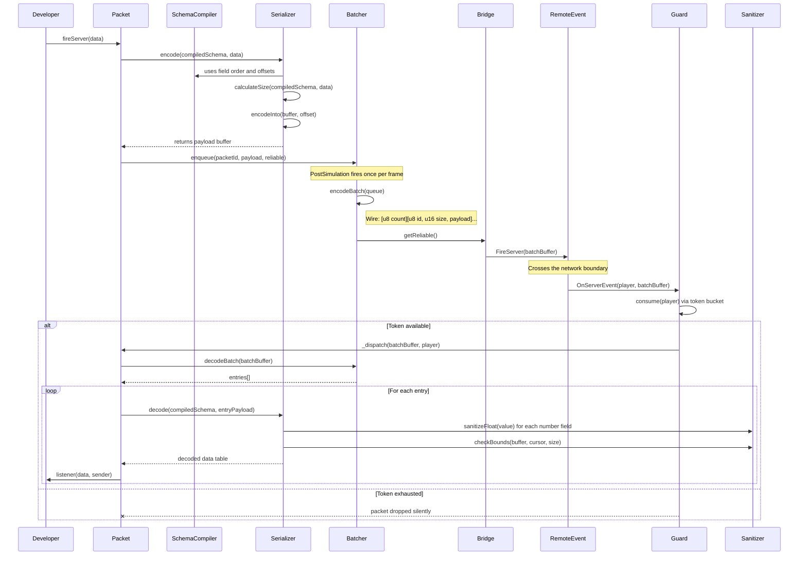
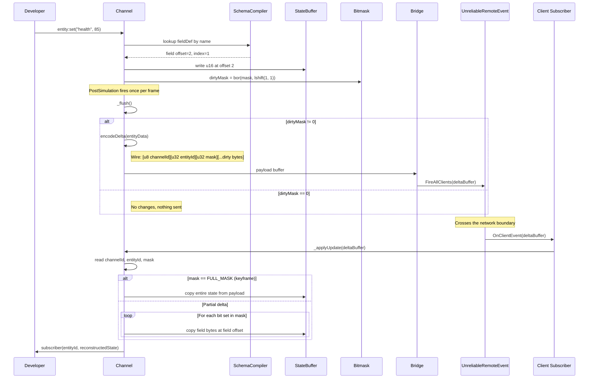

# Architecture

This document describes the internal data flow of Satset. It covers how packets and channels move from the developer's API call through serialization, batching, and transport, and how incoming data is validated and dispatched on the receiving end.

For a high-level overview, see the [data flow diagram in the README](../../README.md#architecture).

## Module Overview

Satset is organized into four layers:

| Layer | Modules | Responsibility |
| :--- | :--- | :--- |
| **Networking** | `Packet`, `Channel` | Public-facing API. Handles definition, dispatch, and listener registration. |
| **Serialization** | `SchemaCompiler`, `Serializer`, `Sanitizer`, `Types` | Converts Luau tables into flat binary buffers and back. |
| **Core** | `Batcher`, `Guard`, `Bridge` | Frame-level batching, rate limiting, and RemoteEvent management. |
| **Transport** | `RemoteEvent`, `UnreliableRemoteEvent` | Roblox-native wire protocol. |

## Packet Lifecycle (Stateless)

The following diagram traces a single `fireServer()` call from the client to the server, including the batching and validation steps.



### Wire Format (Reliable Batch)

```luau
[u8 packetCount]
  [u8 packetId][u16 payloadSize][...payload bytes]
  [u8 packetId][u16 payloadSize][...payload bytes]
  ...
```

### Wire Format (Unreliable Batch)

Unreliable batches include a sequence number for stale packet detection. If the batch exceeds 900 bytes (MTU limit), it is automatically split into multiple sub-batches, each with its own sequence number.

```luau
[u16 sequenceNumber][u8 packetCount]
  [u8 packetId][u16 payloadSize][...payload bytes]
  ...
```

## Channel Lifecycle (Stateful)

Channels handle delta-compressed state synchronization. Instead of sending full state every frame, they track which fields have changed using a 32-bit bitmask and only transmit the dirty bytes.



### Wire Format (Channel Delta)

```luau
[u8 channelId][u32 entityId][u32 dirtyMask][...dirty field bytes]
```

When `dirtyMask == 0xFFFFFFFF` (all bits set), the payload contains the full state buffer. This is used for initial synchronization and periodic resyncs (controlled by `resyncInterval`).

### Resync Mechanism

Channels periodically send a full keyframe to prevent client-side state drift caused by dropped unreliable packets. The default interval is 5 seconds, configurable via `resyncInterval` in the channel definition. During a resync frame, all entities in the channel receive a full state transmission regardless of their dirty mask.

## Sanitization Pipeline

All incoming float values pass through a two-stage validation before reaching the developer's listener:

1. **Bounds Check** (`Sanitizer.checkBounds`): Ensures the buffer read will not exceed the buffer length.
2. **Float Sanitization** (`Sanitizer.sanitizeFloat`): Clamps `NaN` and `Infinity` to `0` using the IEEE 754 identity `v ~= v` for NaN detection.

Additionally, `Types/init.luau` applies `sanitizeFloat` directly in the `read` function of `f32`, `f64`, `Vector3`, `Vector2`, and `CFrame` types. This means float values are sanitized at both the type level and the serializer level.
