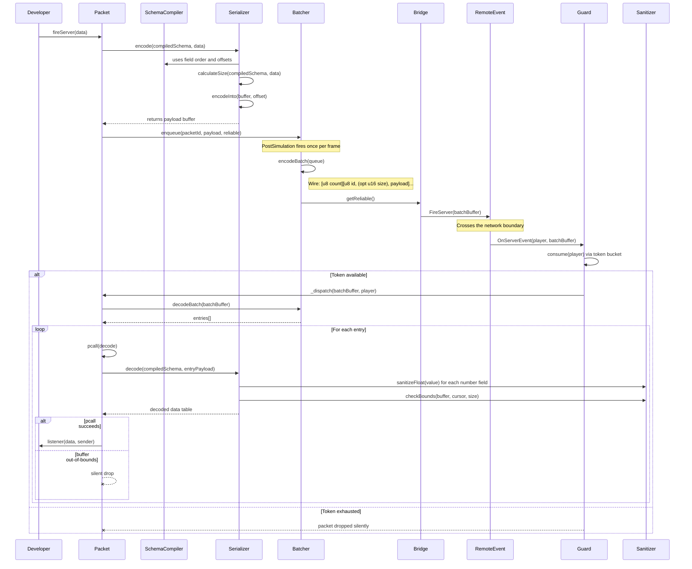
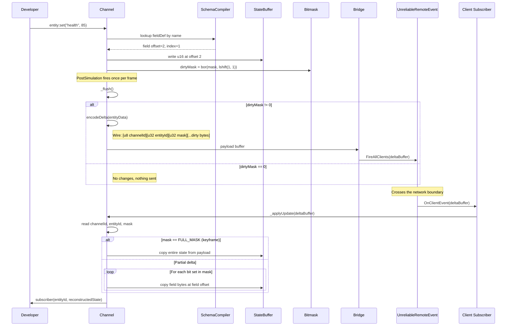

# Architecture

This document describes the internal data flow of Satset. It covers how packets and channels move from the developer's API call through serialization, batching, and transport, and how incoming data is validated and dispatched on the receiving end.

For a high-level overview, see the [data flow diagram in the README](../../README.md#architecture).

## Module Overview

Satset is organized into four layers:

| Layer | Modules | Responsibility |
| :--- | :--- | :--- |
| **Networking** | `Packet`, `Channel` | Public-facing API. Handles definition, dispatch, and listener registration. |
| **Serialization** | `SchemaCompiler`, `Serializer`, `Sanitizer`, `Types` | Converts Luau tables into flat binary buffers and back. |
| **Core** | `Batcher`, `Guard`, `Bridge` | Frame-level batching, rate limiting, and RemoteEvent management. |
| **Transport** | `RemoteEvent`, `UnreliableRemoteEvent` | Roblox-native wire protocol. |

## Packet Lifecycle (Stateless)

The following diagram traces a single `fireServer()` call from the client to the server, including the batching and validation steps.



### Wire Format (Reliable Batch)

```luau
[u8 packetCount]
  [u8 packetId][u16 payloadSize][...payload bytes] (Variable size)
  [u8 packetId][...payload bytes] (Fixed size - size header omitted)
  ...
```

### Wire Format (Unreliable Batch)

Unreliable batches include a sequence number for stale packet detection. If the batch exceeds 900 bytes (MTU limit), it is automatically split into multiple sub-batches, each with its own sequence number.

```luau
[u16 sequenceNumber][u8 packetCount]
  [u8 packetId][u16 payloadSize][...payload bytes] (Variable)
  [u8 packetId][...payload bytes] (Fixed)
  ...
```

## Channel Lifecycle (Stateful)

Channels handle delta-compressed state synchronization. Instead of sending full state every frame, they track which fields have changed using a 32-bit bitmask and only transmit the dirty bytes.



### Wire Format (Channel Delta)

```luau
[u8 channelId][u32 entityId][u32 dirtyMask][...dirty field bytes]
```

When `dirtyMask == 0xFFFFFFFF` (all bits set), the payload contains the full state buffer. This is used for initial synchronization and periodic resyncs (controlled by `resyncInterval`).

### Resync Mechanism

Channels periodically send a full keyframe to prevent client-side state drift caused by dropped unreliable packets. The default interval is 5 seconds, configurable via `resyncInterval` in the channel definition. During a resync frame, all entities in the channel receive a full state transmission regardless of their dirty mask.

## Validation Pipeline

Satset processes incoming data through a strict validation stack before it reaches the developer's listener:

1. **OOB Shielding (`pcall`)**: All packet decoding runs inside a protected call. If a malicious payload forces a read past the end of the buffer, the VM throws an error that is immediately caught and silenced.
2. **Allocation Capping (`table.create`)**: Variable-length types (arrays, strings, maps) mathematically limit their allocations based on the remaining bytes in the payload. This prevents exploiters from crashing the server with massive GC spikes.
3. **Float Sanitization (`Sanitizer.sanitizeFloat`)**: All floating-point fields (`f32`, `f64`, `Vector3`, etc.) are clamped to prevent `NaN` and `Infinity` from propagating into game logic.
4. **Schema Verification (`Sanitizer.checkBounds`)**: For fixed-size schema fields, the serializer checks that enough bytes remain before executing the read.
